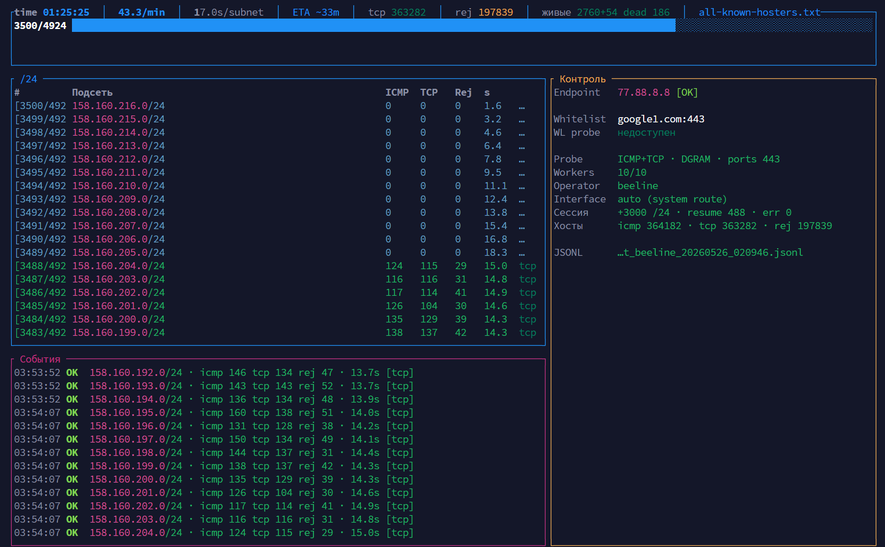

# pizdos-scanner

Сканер `/24` подсетей из Xray/V2Ray `geoip.dat`.  
ICMP используется как дополнительный сигнал, TCP 443 проверяется всегда, остальные TCP-порты берутся из `tcp_ports` в `config.toml`.

Результаты пишутся после каждой подсети, поэтому скан можно остановить и продолжить той же командой.



Интерактивный режим (`console = "tui"` в `config.toml`): прогресс, последние `/24`, endpoint/whitelist, события и resume в одном экране.

## Быстрый старт One-liner автоустановка 

- x86_64/arm64/armv7, включая Raspberry Pi 32-bit и 64-bit
- Рабочая директория `~/.pizdos-scanner`.

```bash
curl -fsSL https://raw.githubusercontent.com/momai/pizdos-scanner/master/install.sh | sh
```

После установки:

```bash
hash -r
export PATH="/usr/local/bin:$PATH"
```
Запустите сканер:

```bash
./pizdos-scanner geoip-scan ru # сканирование всего ru на основе geoip.dat
```

## Ручная установка
Скачайте собранный бинарный файл
```bash
# x86_64
curl -L -o pizdos-scanner \
  https://github.com/momai/pizdos-scanner/releases/latest/download/pizdos-scanner-linux-x86_64
```
```bash
# arm64 (Raspberry Pi 64-bit) 
 curl -L -o pizdos-scanner \
  https://github.com/momai/pizdos-scanner/releases/latest/download/pizdos-scanner-linux-arm64
```
```bash
# armv7 (Raspberry Pi OS 32-bit)
curl -L -o pizdos-scanner \
  https://github.com/momai/pizdos-scanner/releases/latest/download/pizdos-scanner-linux-armv7
```

Скачайте геофайл и конфиг
```bash
curl -L -o geoip.dat \
  https://github.com/Loyalsoldier/v2ray-rules-dat/releases/latest/download/geoip.dat
curl -L -o config.toml \
  https://raw.githubusercontent.com/momai/pizdos-scanner/master/config.toml
chmod +x pizdos-scanner
```

Так же, полезно будет скачать mmdb для заполнения полей ASN и City в результатах.
```bash
mkdir -p db

curl -L -o db/GeoLite2-City.mmdb \
  https://github.com/P3TERX/GeoLite.mmdb/raw/download/GeoLite2-City.mmdb
curl -L -o db/GeoLite2-ASN.mmdb \
  https://github.com/P3TERX/GeoLite.mmdb/raw/download/GeoLite2-ASN.mmdb
```

Запустите сканер:

```bash
./pizdos-scanner geoip-scan ru
```
Если видите ошибку вида `GLIBC_2.38/2.39 not found`, используйте Docker-раздел ниже или соберите бинарь из исходников на своей машине (раздел `Сборка из исходников`).

### Из Docker

```bash
git clone https://github.com/momai/pizdos-scanner
cd pizdos-scanner

docker compose pull
```
Для работы через докер укажите `socket_type = "RAW"` в `config.toml`

Запустите:
```bash
docker compose run --rm pizdos-scanner geoip-scan ru
```


Образ: `ghcr.io/momai/pizdos-scanner:latest`

## Набор команд запуска

- Для установленного приложения:
```bash
./pizdos-scanner help                              # список всех команд
./pizdos-scanner geoip-list                         # показать группы из geoip.dat
./pizdos-scanner geoip-scan ru                      # скан одной группы
./pizdos-scanner geoip-scan cn private telegram     # скан нескольких групп
./pizdos-scanner subnets                            # скан CIDR из config.toml
./pizdos-scanner subnets subnets.txt                # скан CIDR из файла
./pizdos-scanner icmp-fast geoip-scan ru            # быстрый ICMP-only по geoip.dat code
./pizdos-scanner icmp-fast subnets subnets.txt      # быстрый ICMP-only из файла CIDR
./pizdos-scanner tcp-scan-file results/<scan>_icmp_alive.txt 443  # TCP-проверка списка IP
./pizdos-scanner subnet 1.1.1.1                     # скан одной /24 по любому IP внутри неё
./pizdos-scanner finalize results/<scan>.jsonl      # пересобрать *_alive.txt и *_rejected.txt
./pizdos-scanner test 1.1.1.1 80 443                # TCP-проверка IP/портов
./pizdos-scanner test 1.1.1.1 443 --sni example.com # TCP/TLS-проверка с SNI
```

Если бинарь установлен в `PATH`, просто используйте `pizdos-scanner ...`.

- Для Docker:
```bash
docker compose run --rm --no-build pizdos-scanner help
docker compose run --rm --no-build pizdos-scanner geoip-scan ru
...
```

- Команды делают то же самое, что и в разделе для бинаря, но выполняются внутри контейнера.
- `--no-build` ускоряет запуск, если образ уже собран/скачан.

Если остались старые контейнеры:
```bash
docker compose down --remove-orphans
```

## Быстрый скан известных хостеров

В репозитории лежат готовые списки CIDR (по одной сети на строку), собранные из анонсируемых префиксов RIPEstat по ASN провайдеров. Сканер сам разворачивает их в `/24`.

Перекрывающиеся CIDR (например `/22` и вложенный `/23`) схлопываются при генерации.

```bash
./pizdos-scanner subnets subnets/yandex-cloud.txt
./pizdos-scanner subnets subnets/vk-cloud.txt
./pizdos-scanner subnets subnets/regru.txt
./pizdos-scanner subnets subnets/timeweb.txt
./pizdos-scanner subnets subnets/selectel.txt
./pizdos-scanner subnets subnets/all-known-hosters.txt   # все хостеры разом
```
Тоже, для Docker:
```bash
docker compose run --rm --no-build pizdos-scanner subnets subnets/yandex-cloud.txt
```

Обновить списки из RIPEstat:

```bash
python3 scripts/update-hoster-subnets.py
```

## Сборка из исходников (Ubuntu/Debian)

Подготовка:

```bash
sudo apt update
sudo apt install -y build-essential pkg-config libssl-dev curl
curl --proto '=https' --tlsv1.2 -sSf https://sh.rustup.rs | sh
source "$HOME/.cargo/env"
```

Сборка и установка:

```bash
./build.sh
export PATH="$HOME/.local/bin:$PATH"
```

Чтобы добавить в `PATH` навсегда:

```bash
echo 'export PATH="$HOME/.local/bin:$PATH"' >> ~/.bashrc
source ~/.bashrc
```

Системная установка:

```bash
INSTALL_DIR=/usr/local/bin sudo ./build.sh
```

И запустите:
```bash
pizdos-scanner geoip-scan ru
```


### ICMP без `sudo` (Linux, `DGRAM`)

```bash
sudo sysctl -w net.ipv4.ping_group_range="0 1000"
```

```toml
socket_type = "DGRAM"
```

В Docker используется `network_mode: host`, capability `NET_RAW` и RAW-сокеты.


## Конфигурация (`config.toml`)

Основные параметры:

```toml
geoip_dat_path = "geoip.dat"
geoip_codes = ["ru"]

console = "auto" # plain | tui | auto
subnet_parallelism = 1 # /24 workers in parallel (1 = sequential)
```

- `geoip-scan` без аргументов берет коды из `geoip_codes`.
- Аргументы команды переопределяют конфиг.
- `console = "plain"` — progress bar (удобно для Docker).
- `console = "tui"` — дашборд для интерактивного локального терминала.

TCP считается живым, если соединение прошло или порт быстро ответил отказом до `tcp_timeout_ms`.
Быстрый отказ отдельно попадает в `tcp_<port>_rejected_hosts` в CSV и `tcp_rejected` в JSONL.

### Дополнительные параметры

TLS-проверка с SNI:

```toml
tcp_sni_host = "example.com"
```

Принудительный исходящий интерфейс:

```toml
network_interface = "eth1"
```

Тюнинг скорости/чувствительности probe:

```toml
probe_attempts = 2        # сколько попыток ICMP/TCP на один IP
icmp_timeout_ms = 800     # timeout одного ICMP
icmp_retry_delay_ms = 100 # пауза между ICMP попытками
tcp_timeout_ms = 1200     # timeout одного TCP подключения
```

Параллельность скана по `/24`:

```toml
subnet_parallelism = 1       # число /24 worker'ов
# host_probe_parallelism = 500 # опционально: ручной override

```

- При `subnet_parallelism > 1` несколько `/24` обрабатываются одновременно.
- `host_probe_parallelism` — единый semaphore-лимит ICMP/TCP probe на весь скан (один уровень параллельности).
- Если `host_probe_parallelism` не задан, сканер подбирает его автоматически от `subnet_parallelism`.
- Для аккуратного разгона увеличивайте постепенно: `2 -> 4 -> 8`.
- `endpoint` и `[stop_on_available]` продолжают проверяться и в параллельном режиме:
  сканер останавливает запуск новых задач и корректно завершает/прерывает текущий пул при срабатывании условия остановки.

### Результаты и resume

Результаты пишутся после каждой `/24`:

```text
results/*.csv
results/*.jsonl
results/*_alive.txt
results/*_rejected.txt
results/state/<job_id>.json
```

Для уже готового JSONL текстовые списки можно пересобрать:

```bash
pizdos-scanner finalize results/<scan>.jsonl
```

### Endpoint и ротация IP

После каждой `/24` сканер проверяет контрольный endpoint.
Если endpoint не отвечает — `Stop` остановит скан, `ChangeIp` дернет HTTP-хук:

```toml
endpoint = "77.88.8.8"
endpoint_failure_action = "Stop"   # или ChangeIp
```

Для `ChangeIp`:

```toml
[task]
change_ip_url = "http://127.0.0.1:8080/change-ip"
delay_seconds = 10
```

Плановая ротация после N подсетей:

```toml
[task]
stop_every_times = 10
stop_action = "ChangeIp"           # Delay | ChangeIp | Prompt
change_ip_url = "http://192.168.1.1/changeIp"
delay_seconds = 10
```

### Stop on available (whitelist)

Пока whitelist-ресурс недоступен — скан продолжается. Как только стал доступен — скан останавливается.

```toml
[stop_on_available]
enabled = true
target = "google.com"
port = 443
check_before_subnet = true
check_after_subnet = true
```

Если stop сработал после скана подсети, результат этой подсети не пишется и не попадает в resume.

### MaxMind GeoIP (опционально)

`GeoLite2` `.mmdb` нужны только для колонок `city`, `asn`, `as_name`.
Без них скан работает, но эти поля будут `N/A`.

```bash
curl -L -o db/GeoLite2-City.mmdb \
  https://github.com/P3TERX/GeoLite.mmdb/raw/download/GeoLite2-City.mmdb

curl -L -o db/GeoLite2-ASN.mmdb \
  https://github.com/P3TERX/GeoLite.mmdb/raw/download/GeoLite2-ASN.mmdb
```
